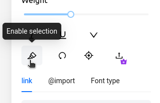
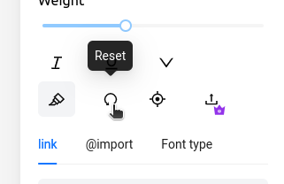
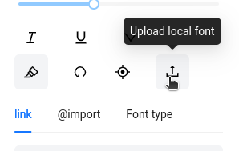
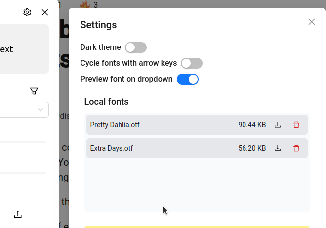
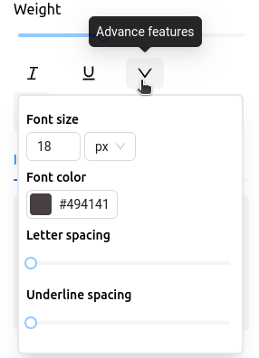
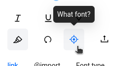
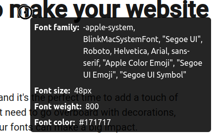
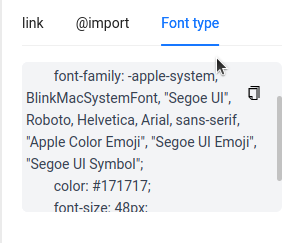

# Documentation for Font Tester

## Table of content
- [Testing fonts](#testing-fonts)
- [Disabling selection.](#disabling-selection)
- [Resetting to original form](#resetting-to-original-form)
- [Uploading local fonts and storing fonts](#uploading-local-fonts-and-storing-fonts)
- [Downloading or deleting uploaded files.](#downloading-or-deleting-uploaded-files)
- [Adjusting font-size colors and more.](#adjusting-font-size-colors-and-more)
- [Settings](#settings)
- [Dark theme](#dark-theme)
- [Cycle fonts](#cycle-fonts)
- [Preview fonts](#preview-fonts)
- [Finding font on a page](#finding-font-on-a-page)

## Testing fonts

To test fonts start by highlighting a text. Then from the font dropdown select 

### Disabling selection.
For some reason you don't want to the highlighting to change you can 
uncheck the enable selection button.

### Resetting to original form
Resetting the font to original is as simple as clicking on the reset button.

## Uploading local fonts and storing fonts

To upload local fonts click

### Downloading or deleting uploaded files.

Every uploaded files are stored locally in your browser, you can download or delete them anytime by going to setting and clicking on download or delete.

## Adjusting font-size colors and more.

If you are a premium user you can adjust and test the font color, font-size, underline spacing and more from the advance menu.

## Settings

To open settings, click on gear icon on the top near the close button

### Dark theme
If you are a premium user, you can toggle between dark and light theme.

### Cycle fonts
If you enable this, You can use your arrow keys to change the fonts from the dropdown.

### Preview fonts
If you disable this, the font dropdown will not show preview of the fonts.

## Finding font on a page

You can easily find the font type, by clicking on the what font button and hovering over a text.

Ctrl/Cmd + Click on the text and the font style will be copied into the modal

