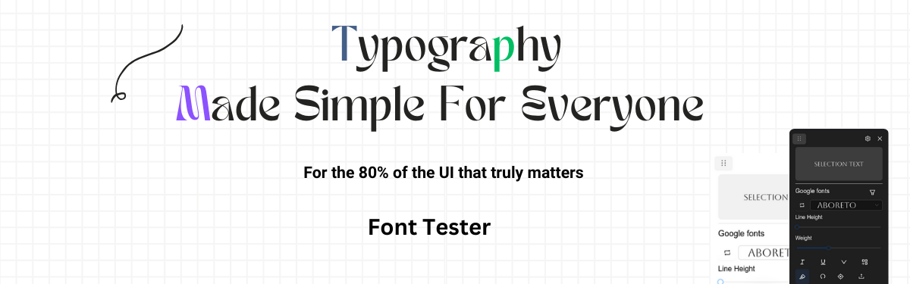
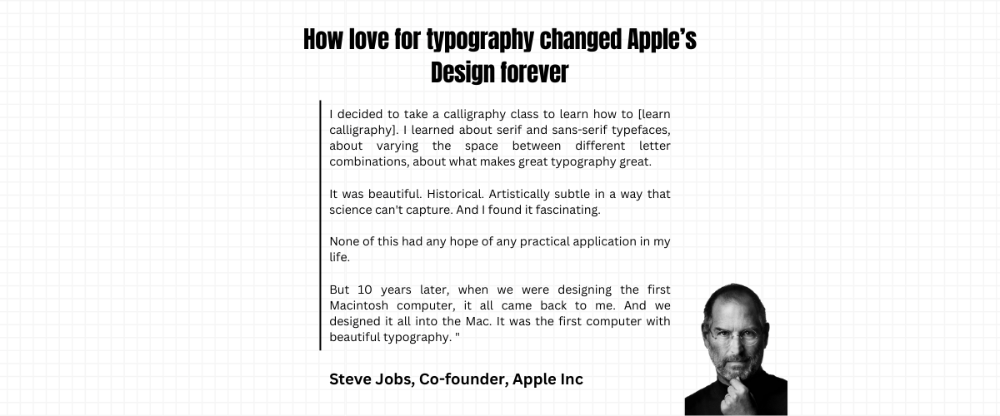

<p align="center"> <h1>Font tester - Test Your Fonts On Live Webpages Effortlesly</h1> </p>

<p align="center"></p>

<p align="center"> <i>Effortlessly pick fonts that demands attention</i></p>


---

[About Font tester ↗️](https://font-tester.foxcraft.tech) . [Download Font tester ↗️](https://chromewebstore.google.com/detail/font-tester/deachoodakeofjlfikfkohihnpcgiaim) . [Docs ↗️](./docs/docs.md)

<!-- <a href="https://chromewebstore.google.com/detail/font-tester/deachoodakeofjlfikfkohihnpcgiaim">
    
</a> -->

---




**Texts make up 80% of your website, make it count!**

Now test 1000+ free google font types and custom types faces on your website.

So whether you are a type designer demoing your type, web developer or creative agency, get Better at website Typography using this extension.


### Compare multiple fonts side-by-side

https://github.com/user-attachments/assets/bd6a20d1-2552-4ed1-a6f8-c66b10f7d5a3


## Download

Download the extension from [Chrome Extension store](https://chromewebstore.google.com/detail/font-tester/deachoodakeofjlfikfkohihnpcgiaim)

or

You can download the dist folder from releases and load it manually

## Whats new 🔥?
* Now find font's from any webpage.
* Preview fonts on the dropdown.
* Cycle fonts using arrow keys.
* Compare different fonts side by side

read more in [changelogs](./changelog.md)

## Why Font Tester is awesome 
✅ Test 1000+ google fonts <br>
✅ Upload custom fonts <br>
✅ Live compare multiple fonts <br>
✅ Find font types used on any webpage <br>
✅ Preview fonts on the dropdown <br>
✅ Move the modal around the webpage. <br>
✅ Set italics, underline, weights, line height etc. <br>
✅ Set font size, filter (premium users)<br>
✅ Set color, letter spacing (premium users)<br>
🔥 More on [Roadmap](roadmap.md)

## How to use Font Tester?

**For full instructions and demo, read the [Docs](./docs/docs.md)**

1. Go to chrome extensions store and download [Font tester](https://chromewebstore.google.com/detail/font-tester/deachoodakeofjlfikfkohihnpcgiaim)
2. Now pin the extension from the puzzle extension icon, located at the top right.
3. Click on the extension, wait few seconds for it to load on your website.
4. Now highlight a text.
5. Select a font.
6. Copy the code and use it. Yes, that's it

> [!NOTE]
During partial text selection, the fonts applied will affect the entire text between the elements, because, inserting elements around selection may affect the style. However, 
In the future we may wrap an element around the selection, based on the user feedback. 


## License

Get advanced features and more
| Type                                                              | Free              | Premium                                                            |
|-------------------------------------------------------------------|-------------------|--------------------------------------------------------------------|
| **Support open-source development**                               | 👍️                 | 😎                                                                  |
| **Priority support** - (priorities your feature requests, issues) | community support | ✅                                                                  |
| **Lifetime license** (one-time  purchase)                         | 👍️                 | ✅                                                                  |
| **Live compare multiple fonts**                                   | ❌                 | ✅                                                                  |
| **Add to collection (upcoming)**                                  | ❌                 | ✅                                                                  |
| **Upload local fonts**                                            | ❌                 | ✅                                                                  |
| **Preview fonts on dropdown**                                     | ❌                 | ✅                                                                  |
| **Adjust font size**                                              | ❌                 | ✅                                                                  |
| **Early access** to upcoming features                             | ❌                 | ✅                                                                  |
| **Adjust font color**                                             | ❌                 | ✅                                                                  |
| **Dark theme**                                                    | ❌                 | ✅                                                                  |
| **Extension for Edge and Firefox**                                | ❌                 | ✅                                                                  |
| **Price**                                                         | Free                |   [Price](https://font-tester.foxcraft.tech/#pricing)                      |
| order now!                                                        |  -                 | [Get license](https://font-tester.foxcraft.tech/#pricing)                       |

---

## Current limitations
* Cannot execute the script in chrome extension store, its blocked by default
* If the font tester doesn't open even after double click on a website, please file an issue


## FAQ

#### How to test different fonts on a webpage?
a. You can use Font Tester extension to test different font's on any webpage.

#### How can I find the fonts used on a webpage?
a. You can use Font Tester extension to find font's on any webpage.

#### How can I test my local fonts?
a. You can test local fonts by purchasing license. It comes with more features to help you test different typography.

## Other free and open-source tools

* [Awesome landing pages](https://github.com/PaulleDemon/awesome-landing-pages)
* [Hover preview - Preview on hover](https://github.com/PaulleDemon/Hover-Preview)
* [Django SaaS Boilerplate](https://github.com/PaulleDemon/Django-SAAS-Boilerplate)


### Follow for updates and open-source

* [Twitter](https://x.com/pauls_freeman)
* [Github](https://github.com/PaulleDemon)


### Tech stack
* Reactjs
* Tailwind css


### Running it locally

The `manifest.json` required for extension is located inside the public folder.

To load the extension locally. Go to extension -> Load unpacked -> point to dist folder (the build folder).

For development use
```
npm run build:dev
```
This is because the extension requires to point to the build folder, using this command you
won't have to rebuild on every save.

For development you can also use 
`npm start`, but you won't be able to load it as extension but as a react app.

Some important notes:
* The extension attaches to a [shadowdom](https://developer.mozilla.org/en-US/docs/Web/API/Web_components/Using_shadow_DOM), this is to avoid page style affecting the widget style.
