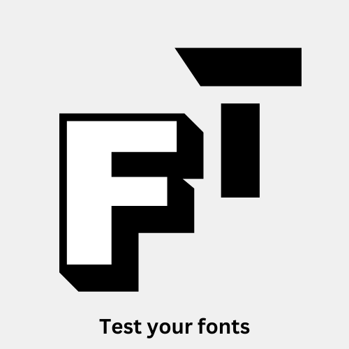

# Font tester - Fonts made easy (chrome extension)


[Font tester](https://font-type.vercel.app)

<p></p>

Finding it difficult to choose the right font? 
Now test 1000+ free google font types on your website.

Font's adds personality to your website, a sans font on a page gives a different impression
of the page than a mono font. But picking the right one can be hard and time consuming. This is
one of the reason I created Font Tester. 

Now you can go to your website, click on the extension, test fonts and pick the one you like along with the code.


## Download

Download the extension from [Chrome Extension store](https://chromewebstore.google.com/detail/font-tester/deachoodakeofjlfikfkohihnpcgiaim)

or

You can download the dist folder from releases and load it manually


## Whom is the meant for?
* Frontend developers.
* Website Designers.
* Landing page designers.
* Solo SaaS developers.
* Freelancers and businesses
* People who want to learn how to create chrome extension with ReactJs.

## How to use Font Tester?
1. Go to chrome extensions store and download [Font tester](https://chromewebstore.google.com/detail/font-tester/deachoodakeofjlfikfkohihnpcgiaim)
2. Now pin the extension from the puzzle extension icon, located at the top right.
3. Click on the extension, wait few seconds for it to load on your website.
4. Now highlight a text.
5. Select a font.
6. Copy the code and use it. Yes, that's it

> [!NOTE]
During partial text selection, the fonts applied will affect the entire text between the elements, because, inserting elements around selection may affect the style. However, 
In the future we may wrap an element around the selection, based on the user feedback. 

## Features of Font Tester
✅ Test 1000+ google fonts <br>
✅ Move the modal around the webpage. <br>
✅ Set italics, underline, weights, line height etc. <br>
✅ Set font size, filter (coming soon...)<br>
🔥 More on [Roadmap](roadmap.md)

## License / support

Though the extension is free to use forever, there is an optional license you can buy to support open-source development. This will provide me with funds to develop an upcoming tool for Python developers.

Pluse you get more advanced features, early access, Upcoming Edge/Firefox addons.
| Type                                                              | Free              | Premium                                                            |
|-------------------------------------------------------------------|-------------------|--------------------------------------------------------------------|
| **Support open-source development**                               | 👍️                 | 😎                                                                  |
| **Priority support** - (priorities your feature requests, issues) | community support | ✅                                                                  |
| **Lifetime license** (one-time  purchase)                         | 👍️                 | ✅                                                                  |
| **Lifetime updates**                                              | ❓️                 | ✅                                                                  |
| **Early access** to upcoming features                             | ❌                 | ✅                                                                  |
| **Adjust font size** (upcoming)                                   | ❌                 | ✅                                                                  |
| **Adjust font color**(upcoming)                                   | ❌                 | ✅                                                                  |
| **Dark theme** (upcoming)                                         | ❌                 | ✅                                                                  |
| **Extension for Edge and Firefox** (upcoming)                     | ❌                 | ✅                                                                  |
| **Price**                                                         | Free             | ~~$49~~ $19 (save 61.22%. for limited time)                        |
| Pre-order now!                                                    |  -                | [Get license](https://foxcraft.gumroad.com/l/font-tester/preorder) |

---
**Other ways to support open-source**

* Order a [custom work](https://tally.so/r/woO0Kx).
* Order a premium SaaS [Landing page template](https://foxcraft.gumroad.com/l/ai-saas-landingpage/saasboost)


## Current limitations
* Cannot execute the script in chrome extension store, its blocked by default
* If the font tester doesn't open even after double click on a website, please file an issue


## Other free and open-source tools

* [Awesome landing pages](https://github.com/PaulleDemon/awesome-landing-pages)
* [Hover preview - Preview on hover](https://github.com/PaulleDemon/Hover-Preview)
* [Django SaaS Boilerplate](https://github.com/PaulleDemon/Django-SAAS-Boilerplate)


### Follow for updates and open-source

* [Twitter](https://x.com/pauls_freeman)
* [Github](https://github.com/PaulleDemon)


### Tech stack
* Reactjs
* Tailwind css


### Running it locally

The `manifest.json` required for extension is located inside the public folder.

To load the extension locally. Go to extension -> Load unpacked -> point to dist folder (the build folder).

For development use
```
npm run build:dev
```
This is because the extension requires to point to the build folder, using this command you
won't have to rebuild on every save.

For development you can also use 
`npm start`, but you won't be able to load it as extension but as a react app.

Some important notes:
* The extension attaches to a [shadowdom](https://developer.mozilla.org/en-US/docs/Web/API/Web_components/Using_shadow_DOM), this is to avoid page style affecting the widget style.